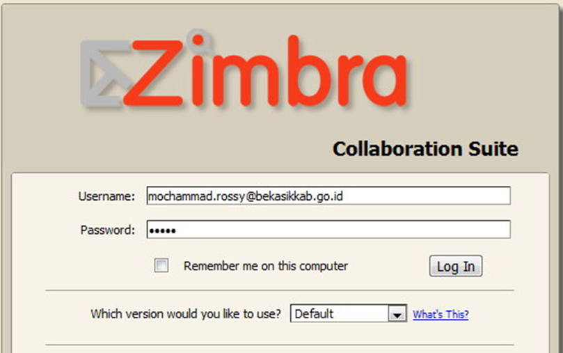

# Implementasi Mail Server Intranet dengan Ubuntu Server & Zimbra

## Latar Belakang

Komunikasi email internal membutuhkan server terpusat yang efisien, aman, dan mudah dikelola. Zimbra dipilih karena open source, mendukung multi domain, quota mailbox, antivirus, antispam, dan administrasi berbasis web.

Pemda Bekasi membutuhkan sistem email internal yang aman, terpusat,
dan mudah dikelola untuk komunikasi antar dinas.

## Tujuan

- Membangun mail server internal.
- Mengonfigurasi hostname, IP, dan DNS.
- Menginstal Zimbra.
- Menguji pengiriman email dan pembuatan akun.

## Tantangan

- Konfigurasi DNS yang benar untuk mail server
- Integrasi antivirus dan antispam
- Migrasi data dari sistem sebelumnya
- Training admin internal

## Tahapan Implementasi

1. Setting hostname & TCP/IP.
2. Konfigurasi DNS BIND9.
3. Update paket database.
4. Disable service Postfix, Apache, OpenLDAP.
5. Install dependency Zimbra.
6. Download & extract Zimbra.
7. Install & konfigurasi Zimbra.
8. Uji `zmcontrol status`, admin panel, dan webmail.

## Hasil

Seluruh service Zimbra berjalan. Admin panel dapat diakses, akun email berhasil dibuat, dan pengguna dapat login melalui webmail pada jaringan intranet. Selain itu, saya juga mengadakan training untuk user agar seluruh pegawai pemda kabupaten agar terbiasa dalam menggunakan
tools mail ini.

## Pelajaran

DNS dan hostname yang benar sangat penting. Service bawaan harus dinonaktifkan sebelum instalasi Zimbra. Dokumentasi memudahkan troubleshooting dan handover.

## Hasil

Mail server berjalan stabil dengan uptime 99.9%. Komunikasi email
internal antar dinas menjadi lebih efisien dan terpusat.
zimbra juga menyediakan chat intranet antar user, sehingga tidak membutuhkan aplikasi tambahan.
